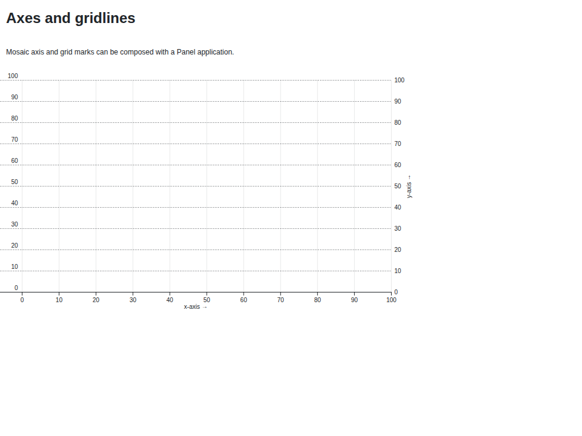
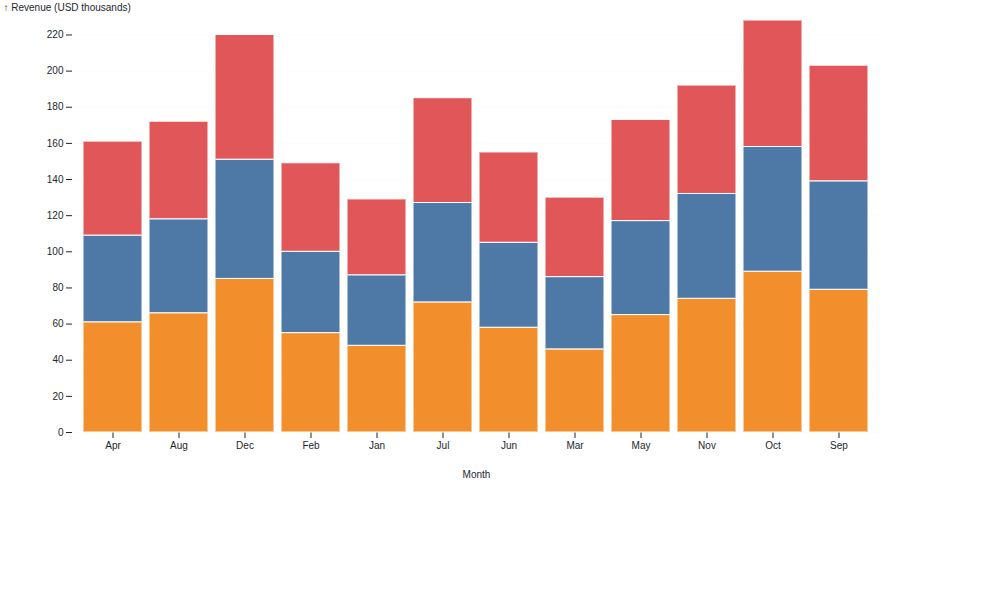

# Examples

## Axes and gridlines

Mosaic axis and grid marks work alongside normal plot options in a Panel
application. The runnable source is
[`examples/axes.py`](https://github.com/panel-extensions/panel-mosaic/blob/main/examples/axes.py).

```bash
panel serve examples/axes.py --show
```



## Monthly revenue dashboard

This example creates the stacked bar chart shown on the home page. It uses an in-memory DuckDB table, but the same component can use a connection that already contains your data.

```python
import duckdb
import panel as pn

from panel_mosaic import Mosaic

pn.extension()

con = duckdb.connect()
con.execute("""
    CREATE TABLE monthly_revenue AS
    SELECT * FROM (
        VALUES
            ('Jan', 'North', 48), ('Jan', 'Central', 39), ('Jan', 'South', 42),
            ('Feb', 'North', 55), ('Feb', 'Central', 45), ('Feb', 'South', 49),
            ('Mar', 'North', 46), ('Mar', 'Central', 40), ('Mar', 'South', 44),
            ('Apr', 'North', 61), ('Apr', 'Central', 48), ('Apr', 'South', 52),
            ('May', 'North', 65), ('May', 'Central', 52), ('May', 'South', 56),
            ('Jun', 'North', 58), ('Jun', 'Central', 47), ('Jun', 'South', 50),
            ('Jul', 'North', 72), ('Jul', 'Central', 55), ('Jul', 'South', 58),
            ('Aug', 'North', 66), ('Aug', 'Central', 52), ('Aug', 'South', 54),
            ('Sep', 'North', 79), ('Sep', 'Central', 60), ('Sep', 'South', 64),
            ('Oct', 'North', 89), ('Oct', 'Central', 69), ('Oct', 'South', 70),
            ('Nov', 'North', 74), ('Nov', 'Central', 58), ('Nov', 'South', 60),
            ('Dec', 'North', 85), ('Dec', 'Central', 66), ('Dec', 'South', 69)
    ) AS t(month, region, revenue)
""")

Mosaic(
    {
        "width": 900,
        "height": 480,
        "colorScheme": "Tableau10",
        "xLabel": "Month",
        "yLabel": "Revenue (USD thousands)",
        "yGrid": "#e5e7eb",
        "plot": [{
            "mark": "barY",
            "data": {"from": "monthly_revenue"},
            "x": "month",
            "y": "revenue",
            "fill": "region",
            "stroke": "white",
            "strokeWidth": 1,
        }],
    },
    con=con,
).servable()
```

Save the example as `app.py`, then launch it with:

```bash
panel serve app.py --show
```



## Interactive wind map

Mosaic features such as vector marks, linked selections, legends, inputs, and
vertically concatenated views work inside a `Mosaic` pane. The complete,
runnable example is available in
[`examples/wind_map.py`](https://github.com/panel-extensions/panel-mosaic/blob/main/examples/wind_map.py).

```bash
panel serve examples/wind_map.py --show
```

Drag over the map or legend to filter the vectors, and use the slider to alter
their length.

## Use an in-memory frame

When your data is already in a pandas or PyArrow object, register it through `data` instead of manually creating a DuckDB table:

```python
import pandas as pd

from panel_mosaic import Mosaic

Mosaic(
    {"plot": [{"mark": "dot", "data": {"from": "points"}, "x": "x", "y": "y"}]},
    data={"points": pd.DataFrame({"x": [1, 2, 3], "y": [2, 4, 3]})},
)
```
