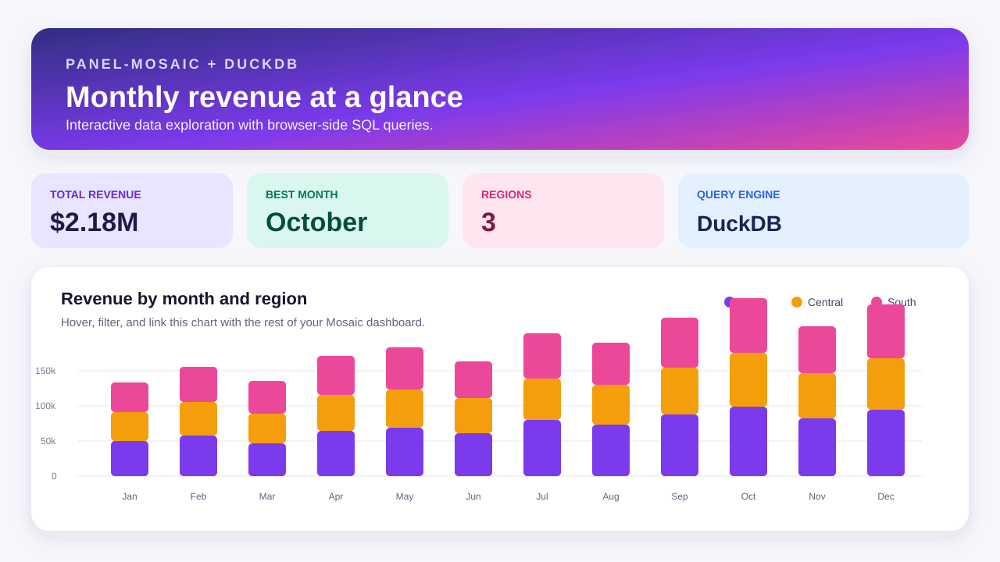

# panel-mosaic

**Interactive, DuckDB-powered [Mosaic](https://idl.uw.edu/mosaic/) visualizations for [Panel](https://panel.holoviz.org/).**

`panel-mosaic` lets Panel applications render declarative Mosaic and vgplot charts. It keeps data in DuckDB and sends only the result of each browser-side query to the chart, making it a strong fit for linked views and large datasets.



## Start here

```bash
pip install panel-mosaic-viz
```

Create a `Mosaic` pane with a chart specification and a DuckDB connection:

```python
import duckdb

from panel_mosaic import Mosaic

con = duckdb.connect()
con.execute("CREATE TABLE points AS SELECT 1 AS x, 2 AS y")

Mosaic(
    {"plot": [{"mark": "dot", "data": {"from": "points"}, "x": "x", "y": "y"}]},
    con=con,
)
```

Continue to [Examples](examples.md) for a complete dashboard or [Reference](reference/panel_mosaic.md) for the component API.
